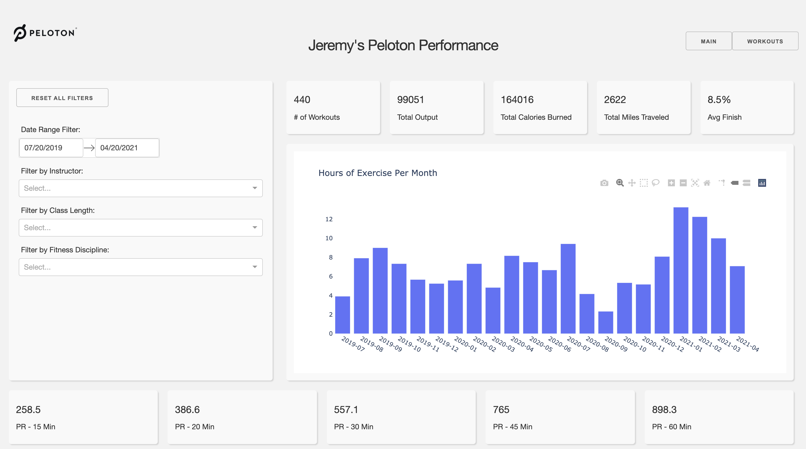

# Peloton App

This app pulls your Peloton data and allows you to filter and visualize it.

(The following instructions apply to MacOSx. I've not been able to test on Windows)

## Dependencies

You will need a few variables stored in your `bash_profile` or `zshenv` file
with the following variable names:
```
PELOTON_DISPLAY_NAME=TheNameYouWantToDisplayOnTheMainPage
PELOTON_USER=YourLeaderboardNameHere
PELOTON_EMAIL=YourEmailHere
PELOTON_PWD=YourPasswordHere
```

## How to run this app

To run this app first clone repository and then change directory to the app folder.

```
git clone https://github.com/JeremyColon/peloton-app.git
cd path/to/peloton-app
```

Create & activate the virtual environment (recommended) by running
the following:

```
virtualenv venv
source venv/bin/activate
```

Install the requirements

```
pip install -r requirements
```

Run the app:

You can either update the `run` file:
```
#!/bin/bash or #!/bin/zsh
python ~/path/to/peloton-app/index.py
```
Then enter `chmod 755 run` into the terminal. You should be able to just double-click to launch the app now.

Alternatively, you can navigate to the folder via the terminal and run the app directly

```
python index.py
```

Once launched, you can open the app in your browser at http://127.0.0.1:8050

Once you're done, shut down the app by pressing ^+C (control+C), then deactivate your virtual environment by running
the following:

```
deactivate
```

## Screenshots

### Main Page




### Workouts Page


## Resources

Reach out to me at jeremycolon24@gmail.com if you run into issues.

